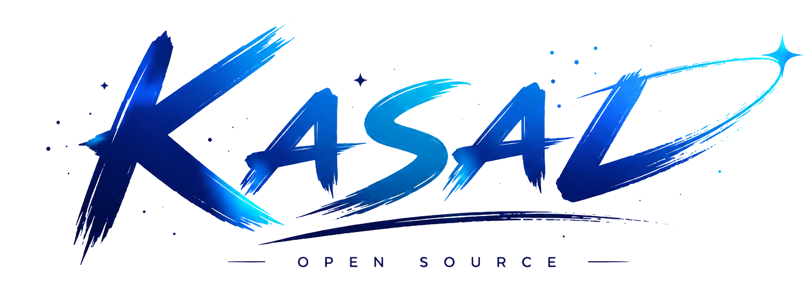
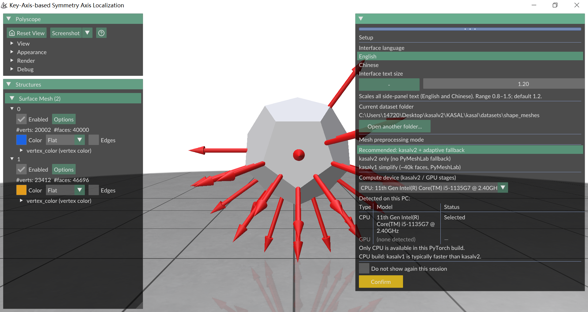
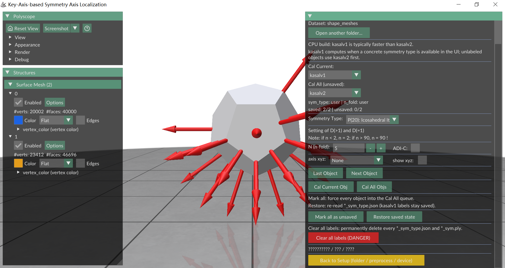

<p align="center">
  
</p>

<p align="center">
  <a href="https://pypi.org/project/kasal-6d/">
    
  </a>
  <a href="https://pepy.tech/project/kasal-6d">
    
  </a>
  <a href="https://github.com/WangYuLin-SEU/KASAL/releases/">
    
  </a>
</p>

<p align="center">
  <i>PyPI badge above reflects the current <b>kasalv1</b> package; integrated <b>KASALv2</b> PyPI release coming soon.</i>
</p>

<div align="center">

**English** | [中文](./README_zh.md)

</div>

---

# KASALv2: Fully Automatic 3D Rotational Symmetry Classification and Axis Localization

**KASALv2** is a fully automatic, reference-free framework for symmetry-type classification, rotational-order identification, and full-axis localization across all eight canonical 3D rotational symmetry types. It is integrated into the **KASAL** desktop GUI alongside the original **kasalv1** pipeline.

**Paper:** [CVPR 2026 Open Access](https://openaccess.thecvf.com/content/CVPR2026/papers/Zhang_KASALv2_Fully_Automatic_3D_Rotational_Symmetry_Classification_and_Axis_Localization_CVPR_2026_paper.pdf)

<a name="en-ret-nav-install"></a>
<a name="quick-start"></a>

### Quick Start (KASALv2 from source)

**→ Full tutorial:** [docs/install_kasalv2.md](docs/install_kasalv2.md) — requirements profiles, verify step, and demo launch.

```bash
conda create -n kasal python=3.10
conda activate kasal
cd KASAL
python scripts/install_deps.py full-cpu    # or full-gpu
python scripts/verify_pytorch3d.py
python demo_shape_meshes.py              # or demo_texture_meshes.py
```

Integrated **KASALv2** is **not on PyPI yet** — install from this repo ([PolyForm Noncommercial 1.0.0](LICENSE)). Classic **kasalv1** on PyPI (`pip install kasal-6d`, [Apache 2.0](https://www.apache.org/licenses/LICENSE-2.0)) → [kasalv1 user guide](docs/README_kasalv1.md).

> **Notice**
>
> - **PyPI:** The integrated **KASALv2** release on PyPI (`kasal-6d` with kasalv2) is **not yet available**. Expected within **~2 weeks** (mid-June 2026). For now, install from source — [install_kasalv2.md](docs/install_kasalv2.md).
> - **Objaverse-SAD:** Rotational-symmetry annotations for **~35,000 Objaverse** objects are in preparation; dataset release expected within **~2 weeks** (Hugging Face link TBD).

### KASAL (kasalv1) User Guide

KASALv2 integrates the original **kasalv1** workflow. For shared GUI features and the classic manual-labeling flow, jump to:

<a name="en-ret-nav-full"></a>
<a name="en-ret-nav-symmetry-types"></a>
<a name="en-ret-nav-visualization"></a>
<a name="en-ret-nav-batch"></a>
<a name="en-ret-nav-texture"></a>
<a name="en-ret-nav-assisted"></a>

| Topic | Open in kasalv1 guide |
|-------|------------------------|
| Full kasalv1 manual | [docs/README_kasalv1.md](docs/README_kasalv1.md) |
| Rotational symmetry types (8 classes) | [Symmetry types](docs/README_kasalv1.md#rotational-symmetry-types) |
| Symmetry axis visualization | [Localization results](docs/README_kasalv1.md#symmetry-axis-localization-results) |
| Batch processing (classic) | [Batch processing](docs/README_kasalv1.md#batch-processing) |
| Texture symmetry (ADI-C) | [Texture symmetry](docs/README_kasalv1.md#texture-rotational-symmetry) |
| Assisted localization (show xyz) | [Assisted localization](docs/README_kasalv1.md#assisted-localization) |
| Datasets (DSRSTO / GSO / ShapeNet) | [Datasets](docs/README_kasalv1.md#datasets) |
| **KASALv2 source install** | [install_kasalv2.md](docs/install_kasalv2.md) |
| kasalv1 install (PyPI) | [Installation](docs/README_kasalv1.md#installation) |

### Principle

KASALv2 localizes a **dominant high-order axis**, infers its **rotational order** through self-consistency analysis, and reconstructs the **complete symmetry structure** under a hierarchy-guided formulation — without requiring a predefined symmetry type. A **texture-aware extension** models appearance-induced reductions in rotational order while preserving axis orientations. Outputs follow the [BOP format](https://bop.felk.cvut.cz/) for downstream 6D pose estimation.

### Background & Applications

Rotational symmetry is an important prior in **6D pose estimation** and symmetry-aware evaluation. Manual or semi-automatic symmetry annotation does not scale. KASALv2 achieves **94.75%** accuracy on **438** symmetric objects in GSO; training FoundationPose with these priors improves accuracy by up to **0.9%** across five BOP datasets. Applications include pose estimation, 3D reconstruction, and object recognition.

### Highlights

- **Dual engines:** kasalv1 (user labels) + kasalv2 (automatic) in one GUI
- **Setup → KASAL** dual-page flow; **English / 中文** UI with adjustable font scale
- **Cal All (unsaved)** incremental batch; subprocess progress modal
- Mesh formats: `.ply`, `.obj`, `.glb`, `.gltf`, `.stl`, `.off`; CPU/GPU device selection

<a name="en-ret-compare-kasalv1"></a>

### kasalv1 vs kasalv2

| Aspect | kasalv1 (original KASAL) | kasalv2 (CVPR 2026) |
|--------|--------------------------|---------------------|
| Input priors | User specifies symmetry type (and *n* when needed) | **No** predefined type; auto classify + order + axes |
| Pipeline | Geometry/texture key-axis templates (PyMeshLab) | PyTorch3D + ICP axis search |
| Best for | Relabeling after user correction; forced **xyz** axis | New datasets; auto-labeling unannotated meshes |
| GUI engines | Separate **Cal Current** / **Cal All** dropdowns | Same; unlabeled + kasalv1 routes to kasalv2 |
| Speed hint | **CPU** build: kasalv1 usually faster | **GPU** build: kasalv2 usually faster |
| Details | [kasalv1 user guide](docs/README_kasalv1.md) | Sections below |

<a name="timeline"></a>

### Timeline

#### KASALv2 / integrated release

- **Jun 2026** — CVPR 2026 paper (Open Access); integrated GUI + kasalv2 (source install)
- **~Mid Jun 2026** *(planned)* — PyPI package with kasalv2
- **~Mid Jun 2026** *(planned)* — **Objaverse-SAD** (~35k objects) on Hugging Face

#### KASAL / kasalv1

- **Sep 2025** — Windows and Ubuntu (Linux) support
- **Mar 2025** — Open source on GitHub and PyPI
- **Dec 2024** — TIP 2024 paper ([DOI](https://doi.org/10.1109/TIP.2024.3515801))

<a name="en-ret-nav-datasets"></a>

### Datasets

* DSRSTO: https://huggingface.co/datasets/SEU-WYL/DSRSTO-dataset
* GSO-SAD: https://huggingface.co/datasets/SEU-WYL/GSO-SAD
* ShapeNet-SAD: https://huggingface.co/datasets/SEU-WYL/ShapeNet-SAD
* **Objaverse-SAD (~35k)** — *Coming soon* (expected mid-June 2026)

Classic dataset descriptions: [kasalv1 — Datasets](docs/README_kasalv1.md#datasets).

### UI Overview

**Setup** (first launch — confirm folder, language, preprocess, device):

<div style="text-align: center;">
  
</div>

**KASAL** main panel (after Confirm — labeling, dual engines, Cal buttons):

<div style="text-align: center;">
  
</div>

### New Features (KASALv2)

<details>
<summary><b>Setup dual-page flow</b> — Configure folder, preprocess, and device before labeling</summary>

1. On launch (or after **Open another folder**), the **Setup** page appears.
2. Choose **Interface language**, **font scale**, **dataset folder**, **mesh preprocess policy**, and **compute device**.
3. Click yellow **Confirm** → settings saved to `KASAL.json` → enter **KASAL** main panel.
4. Use **Back to Setup** to change preprocess/device without deleting disk labels.

</details>

<details>
<summary><b>Interface language & font scale</b> — English / 中文; text size 0.8–1.5 (default 1.2)</summary>

- Toggle **English** / **中文** on Setup; all side-panel strings update via `ui_strings.py`.
- **Interface text size** slider scales ImGui side-panel text; persisted in `KASAL.json`.
- Chinese UI needs `polyscope==2.6.1` and a CJK font (`KASAL_UI_FONT` or system fonts).

</details>

<details>
<summary><b>Mesh preprocess policies</b> — kasalv2 recommended / strict / kasalv1 legacy</summary>

| Policy | Meaning |
|--------|---------|
| **kasalv2_adaptive** *(recommended)* | kasalv2 load; PyMeshLab simplify fallback if kasalv2 fails |
| **kasalv2_strict** | kasalv2 only; no PyMeshLab fallback |
| **kasalv1** | Legacy PyMeshLab simplify (~40k faces) |

Without PyMeshLab, kasalv1 and adaptive fallback are greyed out; only kasalv2_strict/adaptive (kasalv1 path disabled) remain.

</details>

<details>
<summary><b>Compute device</b> — CPU or CUDA GPU for kasalv2 stages</summary>

- Setup shows a device dropdown plus **Type | Model | Status** hardware table.
- CPU-only PyTorch builds grey out GPU and show a full-gpu install hint.
- Choice saved to `KASAL.json`; workers inherit `KASAL_TORCH_DEVICE`.

</details>

<details>
<summary><b>Dual engines & routing</b> — Separate Cal Current vs Cal All engines</summary>

- **Cal Current:** `kasalv1` | `kasalv2` for the active object.
- **Cal All (unsaved):** batch engine for dirty objects only.
- **Routing:** `axis xyz` user override → **kasalv1**; unlabeled objects → **kasalv2**; user-edited labels → kasalv1 path when type is set.
- Speed hints: CPU → kasalv1 faster; GPU → kasalv2 faster.

Related kasalv1 topics: [symmetry types](docs/README_kasalv1.md#rotational-symmetry-types), [texture ADI-C](docs/README_kasalv1.md#texture-rotational-symmetry), [show xyz](docs/README_kasalv1.md#assisted-localization).

</details>

<a name="en-ret-detail-cal-all"></a>

<details>
<summary><b>Saved / unsaved & Cal All</b> — Batch only recomputes changed objects</summary>

> **↩ From kasalv1** — [Batch processing (classic)](docs/README_kasalv1.md#batch-processing)

- **Saved** = `{stem}_sym_type.json` exists on disk; **unsaved** = missing or UI fingerprint changed.
- Status line: `saved: k/N | unsaved: k/N`.
- **Cal All Objs** processes **unsaved only** (not the whole folder).
- **Mark all as unsaved**, **Restore saved state**, **Clear all labels (DANGER)** available.
- Logs append to `KASAL_batch.log` in the dataset folder.

</details>

<a name="en-ret-detail-sym-types"></a>

<details>
<summary><b>Symmetry types (display)</b> — Localized labels; canonical English on disk</summary>

> **↩ kasalv1 details** — [Rotational symmetry types](docs/README_kasalv1.md#rotational-symmetry-types)

- Chinese UI shows translated symmetry-type names in the dropdown.
- `*_sym_type.json` still stores English canonical values (BOP-compatible).
- `sym_type_source` / `n_fold_source` record `user` vs `kasalv2_auto`.

</details>

<a name="en-ret-detail-texture"></a>

<details>
<summary><b>Texture / ADI-C</b> — kasalv2 supports texture; kasalv1 ADI-C still available</summary>

> **↩ kasalv1 details** — [Texture rotational symmetry](docs/README_kasalv1.md#texture-rotational-symmetry)

- Enable **ADI-C** for texture rotational symmetry (try `demo_texture_meshes.py`).
- kasalv2 can analyze with `tex=True`; kasalv1 path unchanged for manual texture mode.

</details>

<a name="en-ret-detail-assisted"></a>

<details>
<summary><b>Axis xyz (kasalv1)</b> — Forced x/y/z axis uses kasalv1 only</summary>

> **↩ kasalv1 details** — [Assisted localization](docs/README_kasalv1.md#assisted-localization)

- Set **axis xyz** to X, Y, or Z to force kasalv1 fitting along that axis (never kasalv2).
- **show xyz** overlay helps pick the nearest canonical axis on difficult meshes.

</details>

<details>
<summary><b>Open another folder</b> — Switch datasets without restarting</summary>

- **Setup** and **KASAL** panels both offer **Open another folder...** (native dialog: zenity/kdialog/tkinter on Linux).
- Switching returns to Setup for re-confirm; blocked while computation runs.

</details>

<details>
<summary><b>Progress modal</b> — Non-blocking subprocess compute with Stop</summary>

- Long jobs run in a **subprocess** (avoids GIL); centered draggable modal with stage % and animated bar.
- **Cal All** shows object queue **k/N**; **Cal Current** shows stage progress only.
- **Stop computation** with danger confirm; partial results are not saved.

</details>

<details>
<summary><b>Back to Setup</b> — Change folder / preprocess / device</summary>

- Yellow **Back to Setup** on the KASAL panel → confirm modal → returns to Setup.
- On-disk `*_sym_type.json` labels are **not** deleted.

</details>

<details>
<summary><b>Headless CLI</b> — Batch without Polyscope GUI</summary>

```bash
python -m kasal.cli.run_job kasal/jobs/example_job.json
```

Install profiles: `headless-cpu`, `headless-gpu`, `full-cpu`, `full-gpu` — see [docs/install.md](docs/install.md).

</details>

### Notes

| Topic | Detail |
|-------|--------|
| Outputs | `{stem}_sym_type.json`, `{stem}_sym.ply` per object |
| Formats | `.ply`, `.obj`, `.glb`, `.gltf`, `.stl`, `.off` (kasalv2 path) |
| Linux GUI | System packages — [install.md §Linux](docs/install.md#linux-ubuntu-2004-gui-system-packages) |

→ Full **kasalv1** guide: [docs/README_kasalv1.md](docs/README_kasalv1.md)

<a name="license"></a>

### License

This repository (**KASALv2**) is licensed under **[PolyForm Noncommercial License 1.0.0](LICENSE)** — **non-commercial use only**.

The legacy **kasalv1-only** PyPI package (`pip install kasal-6d`) remains under [Apache License 2.0](https://www.apache.org/licenses/LICENSE-2.0), distributed separately.

**Contact:** Yulin Wang (王宇林, [yulinwang@seu.edu.cn](mailto:yulinwang@seu.edu.cn)) — for commercial licensing inquiries.

> **License policy:** The current PolyForm Noncommercial license applies to **this release** only and is **not permanent**. For related considerations, we may switch to **[Apache License 2.0](https://www.apache.org/licenses/LICENSE-2.0)** within the next one to two years, or revise licensing when future versions are released.

<a name="citation"></a>

### Citation

If you find our work useful, please cite:

**KASALv2 (CVPR 2026):**

```bibtex
@InProceedings{Zhang_2026_CVPR,
  author    = {Zhang, Mengxin and Wang, Yulin and Luo, Chen and Li, Yongzhe and Zhou, Yijun},
  title     = {KASALv2: Fully Automatic 3D Rotational Symmetry Classification and Axis Localization},
  booktitle = {Proceedings of the IEEE/CVF Conference on Computer Vision and Pattern Recognition (CVPR)},
  month     = {June},
  year      = {2026},
  pages     = {13866--13875}
}
```

**KASAL (TIP 2024):**

```bibtex
@ARTICLE{KASAL,
  author = {Wang, Yulin and Luo, Chen},
  title  = {Key-Axis-Based Localization of Symmetry Axes in 3D Objects Utilizing Geometry and Texture},
  journal= {IEEE Transactions on Image Processing},
  year   = {2024},
  volume = {33},
  pages  = {6720-6733},
  doi    = {10.1109/TIP.2024.3515801}
}
```

---
