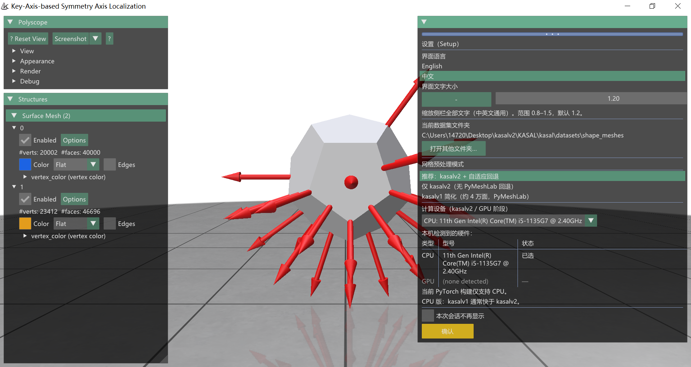
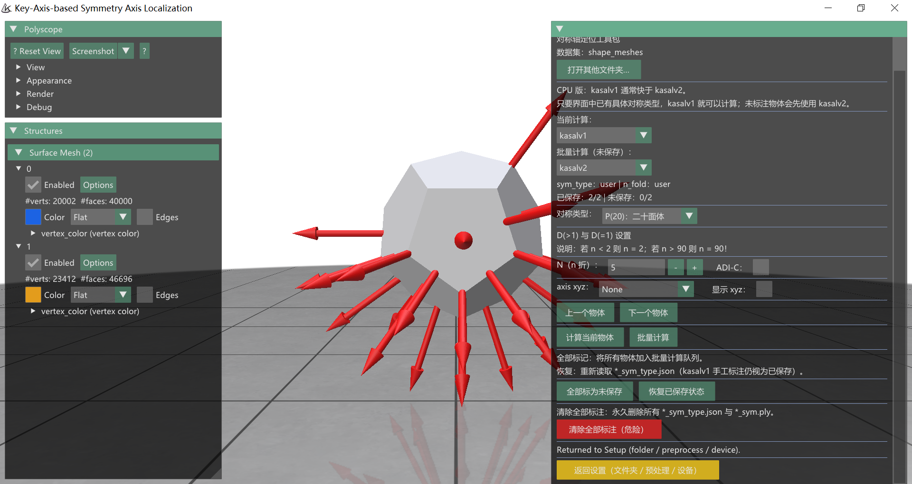

<p align="center">
  
</p>

<p align="center">
  <a href="https://pypi.org/project/kasal-6d/">
    
  </a>
  <a href="https://pepy.tech/project/kasal-6d">
    
  </a>
  <a href="https://github.com/WangYuLin-SEU/KASAL/releases/">
    
  </a>
</p>

<p align="center">
  <i>上方 PyPI 徽章对应当前 <b>kasalv1</b> 包；集成版 <b>KASALv2</b> PyPI 包即将上线</i>
</p>

<div align="center">

[English](./README.md) | **中文**

</div>

---

# KASALv2：全自动三维旋转对称分类与对称轴定位

**KASALv2** 无需参考对称类型，即可自动完成八类典型三维旋转对称的分类、阶数识别与全轴定位，并与原版 **kasalv1** 流程集成于 **KASAL** 桌面 GUI。

**论文：** [CVPR 2026 Open Access](https://openaccess.thecvf.com/content/CVPR2026/papers/Zhang_KASALv2_Fully_Automatic_3D_Rotational_Symmetry_Classification_and_Axis_Localization_CVPR_2026_paper.pdf)

<a name="zh-ret-nav-install"></a>
<a name="quick-start"></a>

### 快速开始（KASALv2 源码安装）

**→ 完整教程：** [docs/install_kasalv2_zh.md](docs/install_kasalv2_zh.md) — 依赖剖面、验证步骤与 demo 启动。

```bash
conda create -n kasal python=3.10
conda activate kasal
cd KASAL
python scripts/install_deps.py full-cpu    # 或 full-gpu
python scripts/verify_pytorch3d.py
python demo_shape_meshes.py              # 或 demo_texture_meshes.py
```

集成版 **KASALv2** **尚未上架 PyPI**，请从本仓库源码安装（[PolyForm Noncommercial 1.0.0](LICENSE)）。经典 **kasalv1** PyPI 包（`pip install kasal-6d`，[Apache 2.0](https://www.apache.org/licenses/LICENSE-2.0)）可参考 [kasalv1 用户手册](docs/README_kasalv1_zh.md)。

> **温馨提示**
>
> - **PyPI：** 集成 **KASALv2** 的 PyPI 包（含 kasalv2 的 `kasal-6d`）**尚未发布**，预计 **约两周内**（2026 年 6 月中下旬）上线。当前请从源码安装 — [install_kasalv2_zh.md](docs/install_kasalv2_zh.md)。
> - **Objaverse-SAD：** **约 3.5 万** Objaverse 物体旋转对称标注制作中，数据集预计 **约两周内**发布（Hugging Face 链接待定）。

### KASAL（kasalv1）用户手册

KASALv2 集成原版 **kasalv1** 流程。共享 GUI 功能与经典手动标注流程请跳转：

<a name="zh-ret-nav-full"></a>
<a name="zh-ret-nav-symmetry-types"></a>
<a name="zh-ret-nav-visualization"></a>
<a name="zh-ret-nav-batch"></a>
<a name="zh-ret-nav-texture"></a>
<a name="zh-ret-nav-assisted"></a>

| 主题 | 打开 kasalv1 文档 |
|------|-------------------|
| kasalv1 全文手册 | [docs/README_kasalv1_zh.md](docs/README_kasalv1_zh.md) |
| 八类旋转对称类型 | [对称类型](docs/README_kasalv1_zh.md#rotational-symmetry-types) |
| 对称轴可视化 | [定位结果](docs/README_kasalv1_zh.md#symmetry-axis-localization-results) |
| 批量处理（经典） | [批量处理](docs/README_kasalv1_zh.md#batch-processing) |
| 纹理对称（ADI-C） | [纹理对称](docs/README_kasalv1_zh.md#texture-rotational-symmetry) |
| 辅助定位（show xyz） | [辅助定位](docs/README_kasalv1_zh.md#assisted-localization) |
| 数据集（DSRSTO / GSO / ShapeNet） | [数据集](docs/README_kasalv1_zh.md#datasets) |
| **KASALv2 源码安装** | [install_kasalv2_zh.md](docs/install_kasalv2_zh.md) |
| kasalv1 安装（PyPI） | [安装](docs/README_kasalv1_zh.md#installation) |

### 原理

KASALv2 定位 **主高阶轴**，经自洽分析推断 **旋转阶数**，在层级引导下重建 **完整对称结构**，无需预定义对称类型。 **纹理扩展** 在保留轴方向的前提下建模外观导致的阶数降低。输出遵循 [BOP 格式](https://bop.felk.cvut.cz/)，便于 6D 位姿估计。

### 背景与应用

旋转对称是 **6D 位姿估计** 与对称感知评测的重要先验。人工标注难以扩展。KASALv2 在 GSO **438** 件对称物体上准确率 **94.75%**；用于 FoundationPose 训练可在五个 BOP 数据集上最高提升 **0.9%**。适用于位姿估计、三维重建、物体识别等。

### 特点

- **双引擎：** kasalv1（用户标注）+ kasalv2（自动）同一 GUI
- **Setup → KASAL** 双页；**中英文** 界面与字号缩放
- **批量计算（仅未保存）** 增量批处理；子进程进度弹窗
- 网格格式：`.ply`、`.obj`、`.glb`、`.gltf`、`.stl`、`.off`；可选 CPU/GPU

<a name="zh-ret-compare-kasalv1"></a>

### kasalv1 与 kasalv2 对比

| 维度 | kasalv1（原 KASAL） | kasalv2（CVPR 2026） |
|------|---------------------|----------------------|
| 输入先验 | 用户指定对称类型（及 *n*） | **无需**预定义；自动分类+定阶+全轴 |
| 管线 | 几何/纹理主轴模板（PyMeshLab） | PyTorch3D + ICP 轴搜索 |
| 适用 | 用户确认后重算；强制 **xyz** 轴 | 新数据集自动标注 |
| GUI 引擎 | **当前计算** / **批量计算** 独立下拉 | 同左；未标注选 kasalv1 会路由 kasalv2 |
| 速度 | **CPU** 版：kasalv1 通常更快 | **GPU** 版：kasalv2 通常更快 |
| 详解 | [kasalv1 用户手册](docs/README_kasalv1_zh.md) | 下文折叠说明 |

<a name="timeline"></a>

### 项目时间轴

#### KASALv2 / 集成版

- **2026 年 6 月** — CVPR 2026 论文；集成 GUI + kasalv2（源码安装）
- **约 2026 年 6 月中下旬** *(计划)* — 含 kasalv2 的 PyPI 包
- **约 2026 年 6 月中下旬** *(计划)* — **Objaverse-SAD**（约 3.5 万件）发布至 Hugging Face

#### KASAL / kasalv1

- **2025 年 9 月** — 支持 Windows 与 Ubuntu (Linux)
- **2025 年 3 月** — GitHub 与 PyPI 开源
- **2024 年 12 月** — TIP 2024 论文（[DOI](https://doi.org/10.1109/TIP.2024.3515801)）

<a name="zh-ret-nav-datasets"></a>

### 数据集

* DSRSTO: https://huggingface.co/datasets/SEU-WYL/DSRSTO-dataset
* GSO-SAD: https://huggingface.co/datasets/SEU-WYL/GSO-SAD
* ShapeNet-SAD: https://huggingface.co/datasets/SEU-WYL/ShapeNet-SAD
* **Objaverse-SAD（约 3.5 万）** — *即将发布*（预计 2026 年 6 月中下旬）

详见 [kasalv1 — 数据集](docs/README_kasalv1_zh.md#datasets)。

### 界面概览

**Setup（设置页）**：

<div style="text-align: center;">
  
</div>

**KASAL 主面板**（Confirm 之后）：

<div style="text-align: center;">
  
</div>

### 新功能说明（KASALv2）

<details>
<summary><b>Setup 双页流程</b> — 标注前先配置文件夹、预处理与设备</summary>

1. 启动或 **打开其他文件夹** 后先显示 **Setup（设置）** 页。
2. 选择 **界面语言**、**字号**、**数据集文件夹**、**网格预处理模式**、**计算设备**。
3. 点击黄色 **确认** → 写入 `KASAL.json` → 进入 **KASAL** 主面板。
4. **返回设置** 可改预处理/设备，不删除磁盘标注。

</details>

<details>
<summary><b>界面语言与字号</b> — 英文 / 中文；字号 0.8–1.5（默认 1.2）</summary>

- Setup 页切换 **English** / **中文**；侧栏文案由 `ui_strings.py` 驱动。
- **界面文字大小** 滑块缩放 ImGui 侧栏文字，写入 `KASAL.json`。
- 中文须 `polyscope==2.6.1` 及 CJK 字体（`KASAL_UI_FONT` 或系统字体）。

</details>

<details>
<summary><b>网格预处理三档</b> — kasalv2 推荐 / 仅 kasalv2 / kasalv1 _legacy</summary>

| 策略 | 含义 |
|------|------|
| **kasalv2_adaptive**（推荐） | kasalv2 加载；失败时 PyMeshLab 简化回退 |
| **kasalv2_strict** | 仅 kasalv2，无 PyMeshLab 回退 |
| **kasalv1** | 经典 PyMeshLab 简化（约 4 万面） |

无 PyMeshLab 时 kasalv1 与带回退项灰显。

</details>

<details>
<summary><b>计算设备</b> — kasalv2 / GPU 阶段可选 CPU 或 CUDA</summary>

- Setup 页设备下拉 + **类型 | 型号 | 状态** 硬件表。
- 仅 CPU 版 PyTorch 时 GPU 灰显并提示安装 full-gpu。
- 选择写入 `KASAL.json`；子进程继承 `KASAL_TORCH_DEVICE`。

</details>

<details>
<summary><b>双引擎与路由</b> — 当前计算与批量计算引擎独立</summary>

- **当前计算：** `kasalv1` | `kasalv2`。
- **批量计算（仅未保存）：** 仅处理 unsaved 物体。
- **路由：** 用户设 **axis xyz** → **kasalv1**；未标注 → **kasalv2**；用户改标签后可走 kasalv1。
- CPU 版 kasalv1 通常更快；GPU 版 kasalv2 通常更快。

相关 kasalv1：[对称类型](docs/README_kasalv1_zh.md#rotational-symmetry-types)、[ADI-C](docs/README_kasalv1_zh.md#texture-rotational-symmetry)、[show xyz](docs/README_kasalv1_zh.md#assisted-localization)。

</details>

<a name="zh-ret-detail-cal-all"></a>

<details>
<summary><b>已保存 / 未保存与批量计算</b> — 仅重算有变动的物体</summary>

> **↩ 来自 kasalv1** — [批量处理（经典）](docs/README_kasalv1_zh.md#batch-processing)

- **已保存** = 磁盘有 `{stem}_sym_type.json`；**未保存** = 无文件或 UI 指纹已变。
- 状态行：`已保存: k/N | 未保存: k/N`。
- **批量计算** 仅处理 **未保存** 物体。
- 支持 **全部标为未保存**、**恢复已保存状态**、**清除全部标注（危险）**。
- 日志写入数据集目录 `KASAL_batch.log`。

</details>

<a name="zh-ret-detail-sym-types"></a>

<details>
<summary><b>对称类型（显示）</b> — 界面可中文；写盘仍英文 canonical</summary>

> **↩ kasalv1 详解** — [旋转对称类型](docs/README_kasalv1_zh.md#rotational-symmetry-types)

- 中文界面下拉显示翻译名称；JSON 仍存英文 canonical（兼容 BOP）。
- `sym_type_source` / `n_fold_source` 区分 `user` 与 `kasalv2_auto`。

</details>

<a name="zh-ret-detail-texture"></a>

<details>
<summary><b>纹理 / ADI-C</b> — kasalv2 支持纹理；kasalv1 ADI-C 仍可用</summary>

> **↩ kasalv1 详解** — [纹理旋转对称](docs/README_kasalv1_zh.md#texture-rotational-symmetry)

- 开启 **ADI-C** 处理纹理旋转对称（可运行 `demo_texture_meshes.py`）。
- kasalv2 支持 `tex=True`；kasalv1 手动纹理模式不变。

</details>

<a name="zh-ret-detail-assisted"></a>

<details>
<summary><b>轴 xyz（kasalv1）</b> — 强制 x/y/z 仅走 kasalv1</summary>

> **↩ kasalv1 详解** — [辅助定位](docs/README_kasalv1_zh.md#assisted-localization)

- **axis xyz** 设为 X/Y/Z 时强制 kasalv1 沿该轴拟合（不用 kasalv2）。
- **show xyz** 辅助在困难网格上选择最接近主轴的坐标轴。

</details>

<details>
<summary><b>打开其他文件夹</b> — 进程内切换数据集</summary>

- **Setup** 与 **KASAL** 均有 **打开其他文件夹...**（Linux：zenity/kdialog/tkinter）。
- 切换后回到 Setup 须重新确认；计算进行中不可切换。

</details>

<details>
<summary><b>进度弹窗</b> — 子进程计算，界面不卡死，可停止</summary>

- 长任务在 **子进程** 执行；居中可拖动弹窗显示阶段与百分比。
- **批量计算** 显示物体队列 **k/N**；**当前计算** 仅显示阶段进度。
- **停止计算** 需危险确认；未完成结果不保存。

</details>

<details>
<summary><b>返回设置</b> — 修改文件夹 / 预处理 / 设备</summary>

- KASAL 面板底部黄色 **返回设置** → 确认后回 Setup。
- 磁盘 `*_sym_type.json` **不删除**。

</details>

<details>
<summary><b>无头 CLI</b> — 无 Polyscope 的批处理</summary>

```bash
python -m kasal.cli.run_job kasal/jobs/example_job.json
```

安装剖面：`headless-cpu`、`headless-gpu`、`full-cpu`、`full-gpu` — 见 [docs/install.md](docs/install.md)。

</details>

### 说明

| 主题 | 内容 |
|------|------|
| 输出 | 每物体 `{stem}_sym_type.json`、`{stem}_sym.ply` |
| 格式 | `.ply`、`.obj`、`.glb`、`.gltf`、`.stl`、`.off`（kasalv2 路径） |
| Linux GUI | 系统依赖 — [install.md §Linux](docs/install.md#linux-ubuntu-2004-gui-system-packages) |

→ 完整 **kasalv1** 手册：[docs/README_kasalv1_zh.md](docs/README_kasalv1_zh.md)

<a name="license"></a>

### 许可

本仓库（**KASALv2**）适用 **[PolyForm Noncommercial License 1.0.0](LICENSE)** — **仅限非商业用途**。

独立 **kasalv1** PyPI 包（`pip install kasal-6d`）仍适用 [Apache License 2.0](https://www.apache.org/licenses/LICENSE-2.0)，另行发布。

**联系人：** 王宇林（[yulinwang@seu.edu.cn](mailto:yulinwang@seu.edu.cn)）— 商业授权事宜请联系此邮箱。

> **许可政策：** 当前 PolyForm 非商业许可仅适用于**本版本**，**并非永久不变**。出于相关考量，我们可能会在未来一至两年内转为 **[Apache License 2.0](https://www.apache.org/licenses/LICENSE-2.0)**，或在后续新版本发布时另行调整。

<a name="citation"></a>

### 引用

**KASALv2（CVPR 2026）：**

```bibtex
@InProceedings{Zhang_2026_CVPR,
  author    = {Zhang, Mengxin and Wang, Yulin and Luo, Chen and Li, Yongzhe and Zhou, Yijun},
  title     = {KASALv2: Fully Automatic 3D Rotational Symmetry Classification and Axis Localization},
  booktitle = {Proceedings of the IEEE/CVF Conference on Computer Vision and Pattern Recognition (CVPR)},
  month     = {June},
  year      = {2026},
  pages     = {13866--13875}
}
```

**KASAL（TIP 2024）：**

```bibtex
@ARTICLE{KASAL,
  author = {Wang, Yulin and Luo, Chen},
  title  = {Key-Axis-Based Localization of Symmetry Axes in 3D Objects Utilizing Geometry and Texture},
  journal= {IEEE Transactions on Image Processing},
  year   = {2024},
  volume = {33},
  pages  = {6720-6733},
  doi    = {10.1109/TIP.2024.3515801}
}
```
