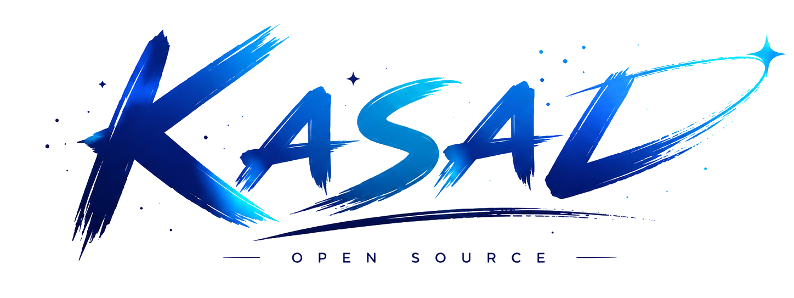
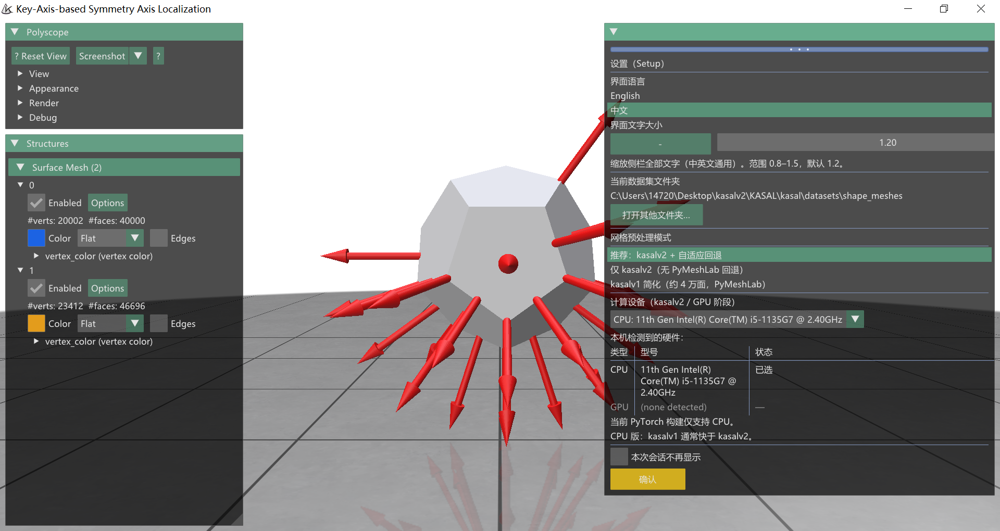
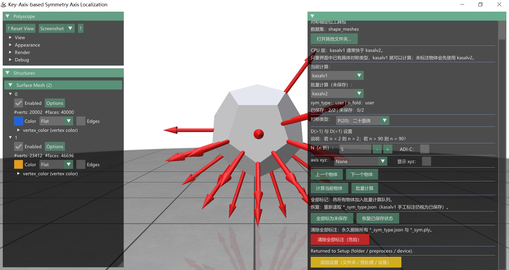

<p align="center">
  
</p>

<p align="center">
  <a href="https://pypi.org/project/kasal-6d/"></a>
  <a href="https://pepy.tech/projects/kasal-6d"></a>
  <a href="https://github.com/WangYuLin-SEU/KASAL/releases/"></a>
</p>

<div align="center">

[English](README.md) | **中文** · [Install](docs/install.md) | [安装](docs/install_zh.md)

</div>

# KASALv2：全自动三维旋转对称分类与对称轴定位

KASALv2 无需预先指定对称类型，即可自动完成三维旋转对称分类、阶数识别与完整对称轴定位。本仓库也在同一桌面应用中保留了原版 **kasalv1** 用户引导流程。

**论文：** [CVPR 2026 Open Access](https://openaccess.thecvf.com/content/CVPR2026/html/Zhang_KASALv2_Fully_Automatic_3D_Rotational_Symmetry_Classification_and_Axis_Localization_CVPR_2026_paper.html) · [PDF](https://openaccess.thecvf.com/content/CVPR2026/papers/Zhang_KASALv2_Fully_Automatic_3D_Rotational_Symmetry_Classification_and_Axis_Localization_CVPR_2026_paper.pdf)

> **PyPI 包名：** KASALv2 **2.0.0** 已正式发布为 [`kasal-6d`](https://pypi.org/project/kasal-6d/2.0.0/)，承接经典 0.1.x 包版本线，提供集成 kasalv1 + KASALv2 的桌面应用。KASALv2 后续版本沿用 `kasal-6d` 包名。Objaverse-SAD 目前正在整理中，后续将正式发布。

## 主要特点

- 自动覆盖八类典型三维旋转对称的分类与完整轴定位
- 以几何分析为主，并可增加独立的纹理感知细化层
- 同一 GUI 集成自动 **kasalv2** 与用户引导 **kasalv1** 两套引擎
- 提供桌面/无头、CPU/CUDA 安装组合
- 支持仅处理未保存对象的增量批处理，以及独立的数据集批处理
- 输出兼容 BOP 对称字段，可用于下游 6D 位姿估计流程

## 快速开始

KASALv2 2.0.0 支持 Python 3.10，默认包含桌面依赖。先安装匹配的 PyTorch/PyTorch3D 运行环境，再从 PyPI 安装 KASALv2。CPU 示例：

```bash
conda create -n kasalv2 python=3.10
conda activate kasalv2
python -m pip install -r https://raw.githubusercontent.com/WangYuLin-SEU/KASAL/3dba824747530bc6296b84b1d5ba6fa172610a18/requirements/torch-cpu.txt
python -m pip install kasal-6d==2.0.0
kasalv2 --help
```

CUDA 环境请在新环境中使用匹配的 `torch-gpu.txt`，详见[安装说明](docs/install_zh.md#pypi-正式版本)。如果在同一环境中从独立的 `kasalv2` 包迁移，请先卸载它再安装 `kasal-6d`，因为两者使用相同的 `kasal` 导入目录。

从源码运行：

推荐使用 Python 3.10 与 conda。仅在具备兼容 NVIDIA/CUDA 环境时选择 `full-gpu`。

```bash
git clone https://github.com/WangYuLin-SEU/KASAL.git
cd KASAL
conda create -n kasal python=3.10
conda activate kasal
python scripts/install_deps.py full-cpu
python scripts/verify_pytorch3d.py
python demo_shape_meshes.py
```

纹理示例运行 `python demo_texture_meshes.py`。GPU、Linux、无头环境与故障排查见[安装指南](docs/install_zh.md)。

## 选择使用方式

| 目标 | 入口 | 输出 |
|------|------|------|
| 在 GUI 中浏览或标注网格 | `python demo_shape_meshes.py` | Sidecar `*_sym_type.json` 与可视化 `*_sym.ply` |
| 在 GUI 中分析纹理示例 | `python demo_texture_meshes.py` | 相同 sidecar 文件；在界面中启用纹理感知分析 |
| 不启动 Polyscope，执行与 GUI 相同的任务 | `python -m kasal.cli.run_job kasal/jobs/example_job.json` | 写在源网格旁的 sidecar 文件 |
| 将平铺数据集处理到独立输出目录 | `python -m kasal.rotational_symmetry.run_dataset --input-dir INPUT --output-dir OUTPUT` | 逐对象 BOP 风格 JSON，以及批量 JSON/CSV 汇总 |
| 使用经典 kasalv1 手动流程 | 在集成 GUI 中选择类型/阶数；原版应用使用 `kasal-6d==0.1.4` | 用户引导的对称轴定位 |

GUI 会递归发现目录内的 `.ply` 和 `.obj`，并忽略生成的 `*_sym.ply`。如果通过任务列表或数据集运行器的匹配模式显式传入文件，KASALv2 加载器还支持 `.glb`、`.gltf`、`.stl` 和 `.off`。

## 使用要点

在 **Setup（设置）**页选择数据集目录、预处理策略和计算设备，然后点击**确认**。处理新数据集时通常保持使用 **kasalv2**。

- 未标注对象使用 kasalv2 自动分析。
- 用户修改过对称类型/阶数，或指定 X/Y/Z 拟合时使用 kasalv1。
- 桌面环境推荐 `kasalv2_adaptive`；没有 PyMeshLab 的无头环境使用 `kasalv2_strict`。
- **批量计算（仅未保存）**只处理尚无保存结果或加载后被编辑的对象。
- 每个完成对象会在源网格旁写入 `{stem}_sym_type.json`，适用时还会写入 `{stem}_sym.ply`。

独立数据集运行器写入单独输出目录，为每个对象生成一份 BOP 风格 JSON，并生成 JSON/CSV 批量汇总。命令行选项可通过以下命令查看：

```bash
python -m kasal.rotational_symmetry.run_dataset --help
```

## 方法概览

```text
网格
  -> 加载、归一化与几何采样
  -> 搜索主高阶轴
  -> 估计旋转周期与阶数
  -> 恢复次轴并分类对称族
  -> 可选：使用外观信息细化
  -> 导出兼容 BOP 的对称数据
```

KASALv2 首先定位主高阶轴，通过自洽分析推断旋转阶数，再以层级引导方式重建完整对称结构。纹理分析以独立层保存，外观造成的阶数变化不会覆盖几何结果。

论文在 GSO 的 438 件对称物体上报告了 **94.75%** 的分类准确率；将估计的对称先验用于 FoundationPose 训练时，在五个 BOP 数据集上最高提升 **0.9%**。

## kasalv1 与 KASALv2

| | kasalv1 | KASALv2 |
|---|---|---|
| 输入 | 用户选择对称类型，必要时指定阶数 | 无需预定义类型或阶数 |
| 主要用途 | 复核、修正与强制 X/Y/Z 轴拟合 | 自动标注新网格和数据集 |
| 核心实现 | PyMeshLab 预处理与主轴模板 | PyTorch3D、轴搜索、周期性与一致性分析 |
| 发布方式 | 经典 [`kasal-6d` 0.1.x](https://pypi.org/project/kasal-6d/0.1.4/)；集成应用也保留该流程 | 集成版 [`kasal-6d` 2.0.0](https://pypi.org/project/kasal-6d/2.0.0/) 及本仓库源码 |
| 手册 | [经典 kasalv1 手册](docs/README_kasalv1_zh.md) | 本 README |

## 界面

**Setup（设置）**页用于选择数据集目录、界面语言、预处理策略与计算设备。

<p align="center">
  
</p>

确认后进入 **KASAL** 主页面，可切换对象、修改标注、选择引擎、计算当前对象或增量批处理。

<p align="center">
  
</p>

## 指南

| 文档 | 内容 |
|------|------|
| [安装指南](docs/install_zh.md) | 依赖组合、CPU/GPU、Linux 系统包与故障排查 |
| [经典 kasalv1 手册](docs/README_kasalv1_zh.md) | 为现有用户保留的手动对称类型流程 |

## 源码结构

| 目录 | 职责 |
|------|------|
| `kasal/app/`、`kasal/cli/` | GUI 和无头任务入口 |
| `kasal/compute/` | 共用任务执行、引擎路由及后台进程 |
| `kasal/config/` | `algorithms.py` 管理 v1/v2 和网格预处理参数；`runtime.py` 管理 GUI 设置与运行状态 |
| `kasal/annotations/` | 标注格式、sidecar 路径及保存状态；`io.py` 处理格式，`state.py` 管理应用状态 |
| `kasal/keyaxis/`、`kasal/symmetry_lab/` | kasalv1 关键轴搜索、对称模板与轴定位 |
| `kasal/rotational_symmetry/` | KASALv2 自动分析与独立数据集运行器 |
| `kasal/geometry/`、`kasal/viz/` | 共用几何处理与可视化导出 |
| `kasal/utils/`、`kasal/datasets/` | 通用工具、示例模型和资源路径 |

代码结构将应用入口、运行状态、标注读写、几何工具以及 KASALv1/KASALv2 算法模块分离。算法参数集中在 `kasal/config/algorithms.py`，可变的 GUI 与运行时状态集中在 `kasal/config/runtime.py`。

## 数据集

- [DSRSTO](https://huggingface.co/datasets/SEU-WYL/DSRSTO-dataset)
- [GSO-SAD](https://huggingface.co/datasets/SEU-WYL/GSO-SAD)
- [ShapeNet-SAD](https://huggingface.co/datasets/SEU-WYL/ShapeNet-SAD)
- **Objaverse-SAD（约 3.5 万件）：** 正在整理中，计划后续正式发布

## 许可

本仓库及其中的集成 KASALv2 源码版本采用 [PolyForm Noncommercial License 1.0.0](LICENSE)，该许可不允许商业使用。商业许可问题请联系王宇林（[yulinwang@seu.edu.cn](mailto:yulinwang@seu.edu.cn)）。

历史经典 `kasal-6d` 0.1.x 版本继续采用 [Apache License 2.0](https://www.apache.org/licenses/LICENSE-2.0)。集成版 2.0.0 使用当前仓库许可证；内置第三方代码保留各自的许可声明。

## 引用

使用 KASALv2 请引用 CVPR 2026 论文：

```bibtex
@InProceedings{Zhang_2026_CVPR,
  author    = {Zhang, Mengxin and Wang, Yulin and Luo, Chen and Li, Yongzhe and Zhou, Yijun},
  title     = {KASALv2: Fully Automatic 3D Rotational Symmetry Classification and Axis Localization},
  booktitle = {Proceedings of the IEEE/CVF Conference on Computer Vision and Pattern Recognition (CVPR)},
  month     = {June},
  year      = {2026},
  pages     = {13866--13875}
}
```

使用原版 kasalv1 方法时还请引用：

```bibtex
@ARTICLE{KASAL,
  author  = {Wang, Yulin and Luo, Chen},
  title   = {Key-Axis-Based Localization of Symmetry Axes in 3D Objects Utilizing Geometry and Texture},
  journal = {IEEE Transactions on Image Processing},
  year    = {2024},
  volume  = {33},
  pages   = {6720--6733},
  doi     = {10.1109/TIP.2024.3515801}
}
```
