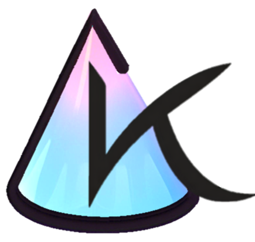
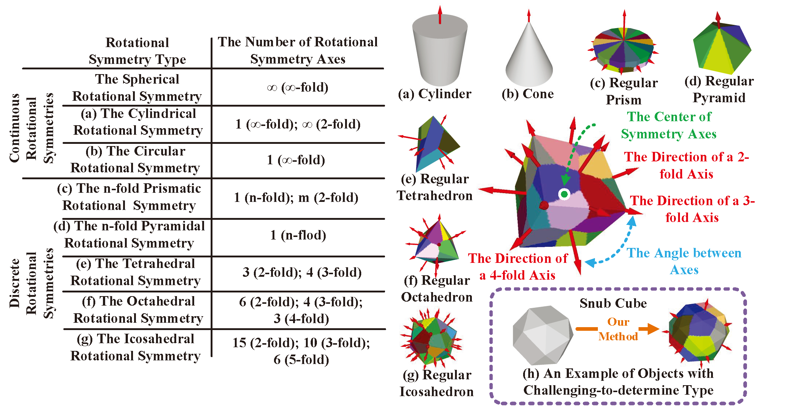
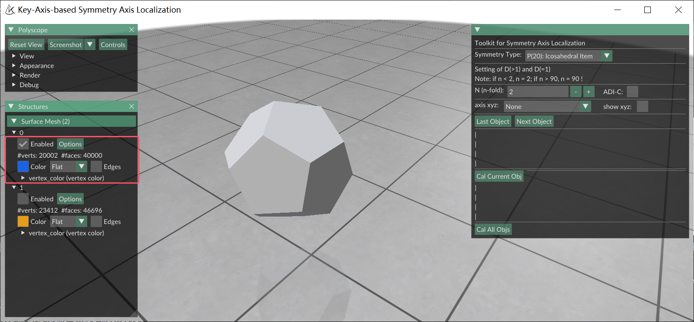
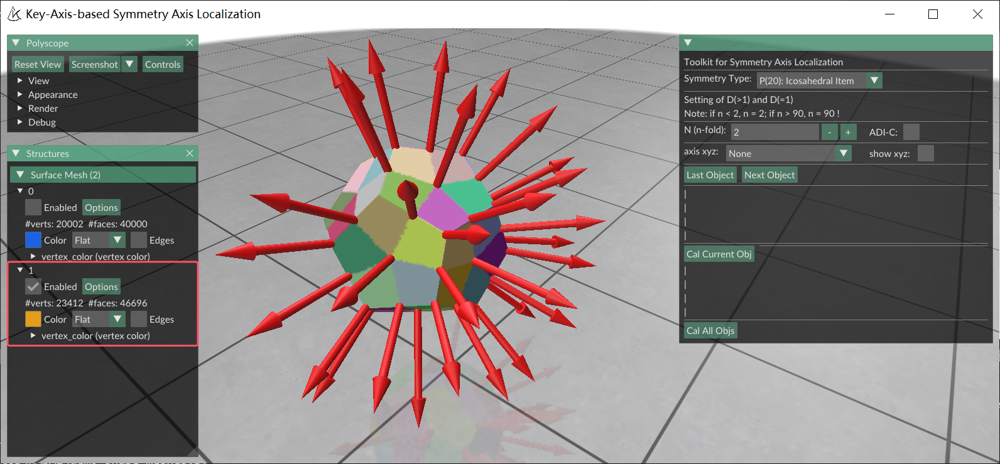

<div align="center">

**English** | [中文](./README_kasalv1_zh.md)

</div>

# KASAL (kasalv1) User Guide

This document describes the **classic kasalv1** interactive workflow (user-specified symmetry types, PyMeshLab-based preprocessing). The integrated GUI still supports these features alongside **KASALv2**.

**KASALv2 (new features)** → [Main README](../README.md) | [主 README（中文）](../README_zh.md)

---

#  KASAL (kasalv1): Key-Axis-based Symmetry Axis Localization

KASAL is a project designed for determining the symmetry axis orientation and the rotation center of rotationally symmetric objects. When using KASAL, users need to specify one of the eight predefined rotational symmetry types. Based on the selected type, KASAL identifies all symmetry axes on the given object model. Upon completion of symmetry axis localization, KASAL automatically saves the rotational symmetry information in the [BOP format](https://bop.felk.cvut.cz/ "BOP Website"). This structured symmetry information facilitates seamless integration with 6D pose estimation methods that support the BOP format. Moreover, the extracted symmetry data is beneficial for various applications, including 3D reconstruction, object recognition, and related computer vision tasks.

> **↩ Return to KASALv2** — You opened the kasalv1 manual from the KASALv2 guide.
> **Back to:** [KASALv2 navigation table](../README.md#en-ret-nav-full) · [kasalv1 vs kasalv2 comparison](../README.md#en-ret-compare-kasalv1)

###  News

See the unified timeline in the [main README — Timeline](../README.md#timeline).

- **Sep 2025**: KASAL officially supports **Windows** and **Ubuntu (Linux)**.
- **Mar 2025**: Fully **open-sourced** on GitHub and PyPI.
- **Dec 2024**: TIP 2024 paper — [DOI: 10.1109/TIP.2024.3515801](https://doi.org/10.1109/TIP.2024.3515801).

<a name="datasets"></a>

###  Datasets

> **↩ Return to KASALv2**
> **Back to:** [Datasets (v2 overview)](../README.md#en-ret-nav-datasets)

To identify which objects exhibit rotational symmetry, you can download the DSRSTO dataset provided with KASAL. Additionally, we have utilized KASAL to determine the symmetry axes of objects in the Google Scanned Objects (GSO) and ShapeNet datasets.

Below are the links to these three datasets:

* DSRSTO: https://huggingface.co/datasets/SEU-WYL/DSRSTO-dataset
* GSO: https://huggingface.co/datasets/SEU-WYL/GSO-SAD
* ShapeNet: https://huggingface.co/datasets/SEU-WYL/ShapeNet-SAD

<a name="installation"></a>

###  Installation

> **↩ Return to KASALv2**
> **Back to:** [Quick Start (v2)](../README.md#en-ret-nav-install) · [KASALv2 navigation table](../README.md#en-ret-nav-full)

* **Platform Support**: KASAL supports both **Windows** and **Ubuntu (Linux)**

>| Platform | Tested Version |
>|----------|----------------|
>| Windows  | Windows 10     |
>| Ubuntu   | 20.04+ (glibc ≥ 2.31) |

* **Requirements**: Anaconda 3, MeshLab

* **Install via PyPI (kasalv1 package)**

KASAL is available on **PyPI** (currently the **kasalv1** build; integrated KASALv2 PyPI coming soon):

```
pip install kasal-6d
```

**License:** This **KASALv2** repository is under **[PolyForm Noncommercial 1.0.0](../LICENSE)**. The standalone **kasalv1** PyPI package (`pip install kasal-6d`) is under **[Apache License 2.0](https://www.apache.org/licenses/LICENSE-2.0)**.

* **Integrated repo (KASAL + kasalv2)**

For **KASALv2** source install (requirements + demo), see [install_kasalv2.md](install_kasalv2.md). Full technical reference: [install.md](install.md). Quick summary: [main README Quick Start](../README.md#quick-start).

* **Quick Start (classic GUI)**

```
python demo_texture_meshes.py
# or
python demo_shape_meshes.py
```

<a name="rotational-symmetry-types"></a>

###  Rotational Symmetry Types

> **↩ Return to KASALv2**
> **Back to:** [Symmetry types — v2 navigation](../README.md#en-ret-nav-symmetry-types) · [Symmetry types — v2 feature details](../README.md#en-ret-detail-sym-types)

KASAL supports a total of eight rotational symmetry types, which include three continuous rotational symmetries and five discrete rotational symmetries.

<div style="text-align: center;">
  
</div>

In KASAL, you can select any rotational symmetry type from the **"Symmetry Type"** dropdown menu and then click **"Cal Current Obj"** to localize the symmetry axes on the object.

Additionally, for **The n-fold Prismatic Rotational Symmetry** and **The n-fold Pyramidal Rotational Symmetry**, users must specify the order of rotational symmetry, denoted as *n*.

<a name="symmetry-axis-localization-results"></a>

###  Symmetry Axis Localization Results

> **↩ Return to KASALv2**
> **Back to:** [Visualization — v2 navigation](../README.md#en-ret-nav-visualization)

Given a **regular dodecahedron** and its specified rotational symmetry type, KASAL can accurately determine the **orientations of all symmetry axes** and the **rotation center** on the object model.

Furthermore, KASAL provides a **visual representation** of these symmetry axes, including their **directions, orders, and the rotation center**.

<div style="text-align: center;">
  
</div>

In the visualization of **symmetry axis directions** and the **rotation center**, KASAL places the **arrow's starting point at the rotation center** and aligns its **direction with the symmetry axis**.

For the visualization of **symmetry axis order**, KASAL first generates a **set of transformation matrices** that satisfy the specified rotational symmetry. It then applies these matrices to **recolor the object's vertices** accordingly.

<div style="text-align: center;">
  
</div>

<a name="batch-processing"></a>

###  Batch Processing

> **↩ Return to KASALv2**
> **Back to:** [Batch processing — v2 navigation](../README.md#en-ret-nav-batch) · [Cal All (unsaved) — v2 feature details](../README.md#en-ret-detail-cal-all)

> **Note (integrated GUI):** In the **KASALv2** desktop app, **Cal All Objs** only processes **unsaved (dirty)** objects. The workflow below describes the **classic kasalv1** batch behavior.

Given a directory path (e.g., `mesh_path`), KASAL will automatically load all 3D model files from the subfolders within this directory. You then need to manually specify each model's **symmetry type**, **order (if applicable)**, and whether it exhibits **texture rotational symmetry**.

Once the rotational symmetry information for all objects has been determined, you can click **"Cal All Objs"** to perform batch symmetry axis localization for all models.

Additionally, KASAL automatically saves the specified rotational symmetry information when switching between objects. However, for the **last object in the directory**, please switch back to the previous object to ensure the data is saved.

If there is only **one object** in the directory, clicking **"Cal Current Obj"** or **"Cal All Objs"** will complete the symmetry axis localization and automatically save the specified symmetry information.

For **KASALv2 Cal All (unsaved)** semantics, see the [main README](../README.md#en-ret-detail-cal-all).

```
from kasal.app.polyscope_app import app

mesh_path = 'The directory of your 3D model dataset'

app(mesh_path)
```

<a name="texture-rotational-symmetry"></a>

###  Texture Rotational Symmetry

> **↩ Return to KASALv2**
> **Back to:** [Texture ADI-C — v2 navigation](../README.md#en-ret-nav-texture) · [Texture / ADI-C — v2 feature details](../README.md#en-ret-detail-texture)

In real-world scenarios, most rotationally symmetric objects exhibit **geometric rotational symmetry**, while a smaller number of objects possess **texture rotational symmetry**.

By default, KASAL employs a **geometry-based symmetry axis localization mode**. If an object exhibits texture rotational symmetry, users need to manually enable the **"ADI-C"** option.

<a name="assisted-localization"></a>

###  Assisted Localization

> **↩ Return to KASALv2**
> **Back to:** [show xyz — v2 navigation](../README.md#en-ret-nav-assisted) · [Axis xyz (kasalv1) — v2 feature details](../README.md#en-ret-detail-assisted)

KASAL performs well for most objects, but it may encounter errors when handling **imperfect or approximately rotationally symmetric objects**.

If KASAL fails to correctly localize the symmetry axes, you can enable **"show xyz"** and manually select the **x, y, or z axis** that you believe is closest to the **primary key axis**.

The **primary key axis** refers to the symmetry axis with the **highest order** on the object.

<div style="text-align: center;">
  
</div>

<a name="citation"></a>

###  Citation

If you use **kasalv1**, please cite the TIP 2024 paper. If you use **KASALv2**, cite the CVPR 2026 paper first — see [main README — Citation](../README.md#citation).

```bibtex
@ARTICLE{KASAL,
  author = {Wang, Yulin and Luo, Chen},
  title  = {Key-Axis-Based Localization of Symmetry Axes in 3D Objects Utilizing Geometry and Texture},
  journal= {IEEE Transactions on Image Processing},
  year   = {2024},
  volume = {33},
  pages  = {6720-6733},
  doi    = {10.1109/TIP.2024.3515801}
}
```

---
