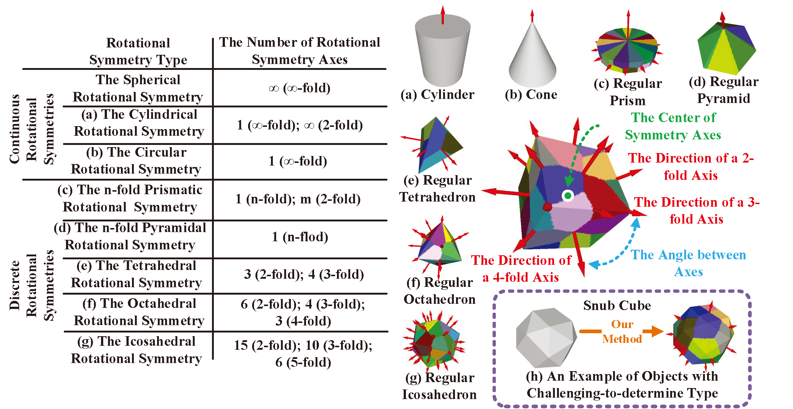
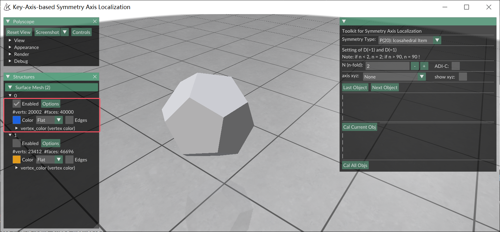
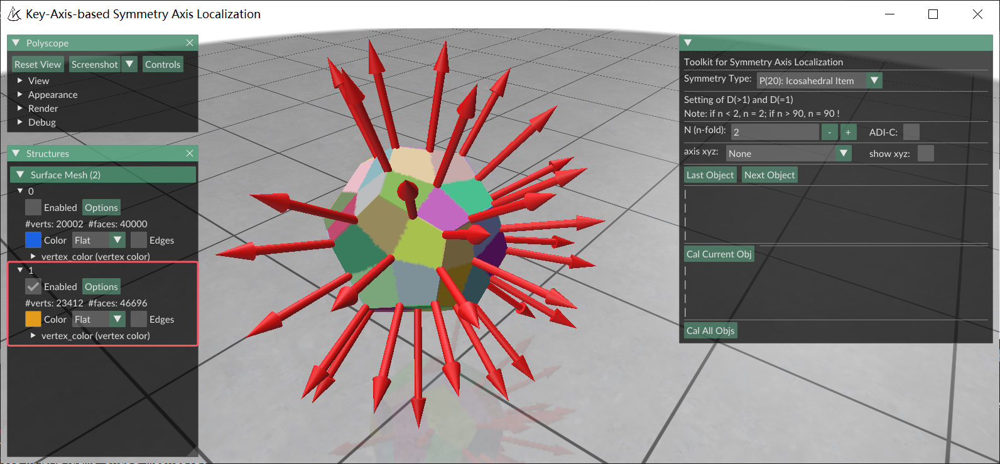

<div align="center">

[English](README_kasalv1.md) | **中文** · [KASALv2 主页](../README_zh.md)

</div>

# KASAL（kasalv1）用户手册

本文介绍原版用户引导 KASAL 流程：用户提供对称类型和阶数，kasalv1 据此定位对应的对称轴与旋转中心。当前仓库在自动 KASALv2 引擎之外继续保留该流程。

自动分析、当前 GUI 行为和命令行批处理见[项目 README](../README_zh.md#使用要点)。

## 发布方式

| 发布物 | 内容 | 许可 |
|--------|------|------|
| 当前源码仓库 | 集成 kasalv1 + KASALv2 应用 | [PolyForm Noncommercial 1.0.0](../LICENSE) |
| [PyPI 上的 `kasal-6d`](https://pypi.org/project/kasal-6d/) | 经典 kasalv1 包 | [Apache License 2.0](https://www.apache.org/licenses/LICENSE-2.0) |

安装经典包：

```bash
pip install kasal-6d
```

如需运行集成源码应用，请按[源码安装指南](install_zh.md)操作。

## 启动集成 GUI

```bash
python demo_shape_meshes.py
```

纹理示例：

```bash
python demo_texture_meshes.py
```

也可以打开自己的数据集：

```python
from kasal.app.polyscope_app import app

app(r"C:\path\to\mesh_dataset")
```

集成 GUI 会递归发现 PLY 和 OBJ。KASALv2 显式传入时支持的其他格式见[使用方式概览](../README_zh.md#选择使用方式)。

<a id="rotational-symmetry-types"></a>

## 旋转对称类型

KASAL 使用八个 canonical 类型：三类连续对称和五类离散对称。

<p align="center">
  
</p>

| 标签 | 用户输入 |
|------|----------|
| `C(>>1): Spherical Item` | 类型 |
| `C(>1): Cylindrical Item` | 类型 |
| `C(=1): Circular Item` | 类型 |
| `D(>1): n-fold Prismatic Item` | 类型与阶数 *n* |
| `D(=1): n-fold Pyramidal Item` | 类型与阶数 *n* |
| `P(4): Tetrahedral Item` | 类型 |
| `P(8): Octahedral Item` | 类型 |
| `P(20): Icosahedral Item` | 类型 |

在主面板中：

1. 选择具体的**对称类型**。
2. 对 n 折棱柱或棱锥设置 *n*。
3. 将当前对象引擎选为 **kasalv1**。
4. 点击**当前计算**。

如果对象尚未标注，集成应用即使收到 kasalv1 请求也会路由到 KASALv2，避免在缺少必要类型时运行手动流程。

<a id="symmetry-axis-localization-results"></a>

## 对称轴定位结果

KASAL 会估计给定对称族蕴含的全部轴以及共享旋转中心。可视化用箭头表示轴方向，并用顶点颜色区分对称阶数。

<p align="center">
  
</p>

箭头从旋转中心出发，并沿对称轴方向指向。

<p align="center">
  
</p>

结果保存为 `*_sym_type.json`，并可按请求写出 `*_sym.ply`。

<a id="texture-rotational-symmetry"></a>

## 纹理旋转对称

物体几何的旋转阶数可能高于其外观。需要让纹理或颜色参与对称判断时启用 **ADI-C**；自带示例使用 `demo_texture_meshes.py`。

集成 KASALv2 路径把纹理感知结果单独存入 `texture_symmetry`，不会覆盖几何结果。

<a id="assisted-localization"></a>

## 辅助定位

近似对称或不完美网格可能使主轴不明确。可启用 **show xyz** 显示规范坐标轴，再选择最接近预期主关键轴的 X、Y 或 Z 轴。

<p align="center">
  
</p>

选择坐标轴覆盖后，计算总是路由到 kasalv1；同时仍须提供具体对称类型。

<a id="batch-processing"></a>

## 批量处理

集成应用中的**批量计算（仅未保存）**只处理没有有效 sidecar 的对象，或加载后被编辑的对象。每个对象成功后立即保存结果。

如需可复现的非交互执行，可使用 `python -m kasal.cli.run_job JOB.json`。它通过 `defaults.sym_type`、`defaults.n_fold` 与 `defaults.axis_xyz` 接收相同的手动字段。

独立发布的 PyPI 包保留其[项目页面](https://pypi.org/project/kasal-6d/)所述的经典 kasalv1 应用；其界面可能与当前集成源码应用不同。

<a id="datasets"></a>

## 数据集

- [DSRSTO](https://huggingface.co/datasets/SEU-WYL/DSRSTO-dataset)
- [GSO-SAD](https://huggingface.co/datasets/SEU-WYL/GSO-SAD)
- [ShapeNet-SAD](https://huggingface.co/datasets/SEU-WYL/ShapeNet-SAD)

<a id="citation"></a>

## 引用

```bibtex
@ARTICLE{KASAL,
  author  = {Wang, Yulin and Luo, Chen},
  title   = {Key-Axis-Based Localization of Symmetry Axes in 3D Objects Utilizing Geometry and Texture},
  journal = {IEEE Transactions on Image Processing},
  year    = {2024},
  volume  = {33},
  pages   = {6720--6733},
  doi     = {10.1109/TIP.2024.3515801}
}
```

如果使用自动 KASALv2 方法，还请引用[项目 README](../README_zh.md#引用)中的 CVPR 2026 论文。
